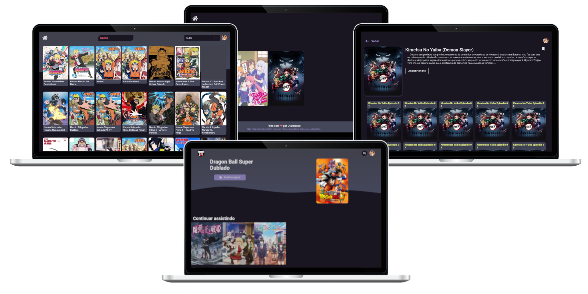

<h1 align="center"></h1>

<div align="center">
  <p>
    <strong>Seu site de animes open source</strong>
  </p>
  <p>
    <a href="https://vercel.com/?utm_source=brasilapi" target="_blank" rel="noopener">
      
    </a>
  </p>
</div>

# AnimeTempest

<div align="center">

[](https://discord.gg/s9jKHJwxqH)
[](https://github.com/SMCodesP/animetempest)


</div>



Esse projeto é um website simples usando React com NextJS para asssitir animes online, nesse website não hospedo nenhum animes, apenas uso de uma API que disponibiliza dados dos animes, porém caso você for usar essa API produtivamente lembre-se que ela tem alguns bugs nos episódios como listagem bagunçada e alguns faltando episódios.

## Funções

- [x] **Player de video**
- [x] **Listagem de animes**
- [x] **Autenticação**
- [x] **Salvando dados** (Progresso do video, histórico, favoritos)
- [ ] **Perfil**
- [ ] **Estatísticas e top de usuários**

## Como usar

1. **Clone esse repositório**

```bash
git clone https://github.com/SMCodesP/animetempest
```

2. **Configure variáveis ambientes**

```bash
# Copie o arquivo de examples das variaveis ambientes e siga os comentários para preenchê-las
cp .env.example .env
```

3. **Instale dependências**

```bash
yarn
# or
npm install
```

4. **Iniciar**

```bash
yarn dev
# or
npm run dev
```

<br>

---

<p align="center">
  Copyright © 2020-present, <b>SMCodes<b>.
</p>
